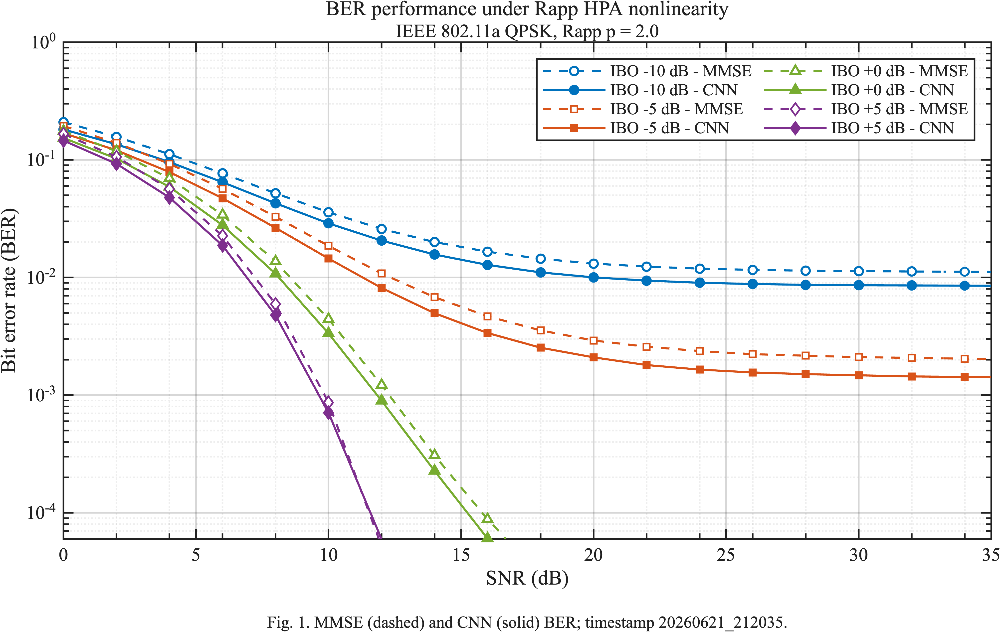

# HPA-CNN: Neural OFDM Receiver for Nonlinear RF Front-Ends

HPA-CNN is a MATLAB research project that evaluates a convolutional neural
receiver for uncoded IEEE 802.11a QPSK OFDM frames affected by nonlinear RF
power-amplifier distortion. The system models a memoryless Rapp high-power
amplifier (HPA), adds flat AWGN, and compares a learned CNN detector against a
pilot-assisted MMSE equalizer through BER vs SNR benchmarks.

This repository is part of my degree thesis in Computer, Electronic and
Telecommunications Engineering.

## System Overview

- **PHY layer:** IEEE 802.11a legacy OFDM, FFT 64, cyclic prefix 16, 52 active
  carriers, 48 payload carriers, 4 standard pilots, QPSK at 12 Mb/s, no FEC.
- **RF impairment:** memoryless Rapp AM/AM HPA model with fixed absolute drive
  from input back-off (IBO). No per-frame AGC, clipping, or power
  normalization is applied before the CNN.
- **Channel:** flat AWGN after the HPA stage.
- **Baseline receiver:** pilot-based MMSE equalization using the standard
  IEEE 802.11a pilot tones.
- **Neural receiver:** a 1-D residual CNN over the OFDM carrier axis, trained
  to classify payload symbols and optimize a combined cross-entropy plus
  soft-symbol MSE objective.
- **Outputs:** MATLAB checkpoints, numeric result files, Base64-encoded JSON
  logs, and BER vs SNR performance plots.

## Final Performance Test

The latest BER vs SNR plot has been renamed to:



The MATLAB figure is also available as `CHARTS/performance_test.fig`.

### Benchmark Configuration

| Item | Value |
| --- | --- |
| Result timestamp | `20260621_212035` |
| Model checkpoint | `CHECKPOINTS/ck_p05_20260621_211211.mat` |
| Distortion model | Rapp AM/AM HPA + flat AWGN |
| Rapp smoothness | `p = 2` |
| IBO sweep | `[-10, -5, 0, 5] dB` |
| SNR sweep | `0:2:36 dB` |
| Packets per IBO/SNR point | `300` |
| Payload bits per point | `1.44e6` |
| Methods | MMSE baseline, CNN receiver |

### Overall Results

| Metric | Value |
| --- | ---: |
| Total evaluated points | `76` |
| CNN lower BER than MMSE | `55 / 76` points (`72.37%`) |
| CNN equal or lower BER than MMSE | `69 / 76` points (`90.79%`) |
| Strongest average gain region | IBO `-5 dB` |
| Best average BER reduction | `25.12%` at IBO `-5 dB` |

### BER Summary by IBO

| IBO (dB) | Saturated samples | BER at 0 dB, MMSE -> CNN | BER at 20 dB, MMSE -> CNN | BER at 36 dB, MMSE -> CNN | Avg. BER reduction | CNN better points |
| ---: | ---: | ---: | ---: | ---: | ---: | ---: |
| `-10` | `91.09%` | `2.092E-1 -> 1.813E-1` | `1.312E-2 -> 1.002E-2` | `1.115E-2 -> 8.494E-3` | `20.96%` | `19 / 19` |
| `-5` | `74.48%` | `1.939E-1 -> 1.685E-1` | `2.915E-3 -> 2.096E-3` | `2.027E-3 -> 1.422E-3` | `25.12%` | `19 / 19` |
| `0` | `38.08%` | `1.759E-1 -> 1.535E-1` | `9.722E-6 -> 1.042E-5` | `2.083E-6 -> 2.083E-6` | `4.63%` | `11 / 19` |
| `5` | `3.82%` | `1.660E-1 -> 1.459E-1` | `0 -> 0` | `0 -> 0` | `4.26%` | `6 / 19` |

BER values reported as `0` mean that no bit errors were observed over the
tested `1.44e6` payload bits for that specific IBO/SNR point.

## Training Overview

The final checkpoint was trained with the standard profile and the adaptive
curriculum selected the `saturation-to-linear` direction. Training data is
generated on the fly from randomized IEEE 802.11a frames, HPA operating
points, Rapp smoothness values, and SNR values.

| Stage | IBO range | SNR range | Examples per epoch | Epochs | Learning rate |
| --- | ---: | ---: | ---: | ---: | ---: |
| Phase 1 | `0..3 dB` | `18..35 dB` | `6,000` | `4` | `1.0E-3` |
| Phase 2 | `3..8 dB` | `12..35 dB` | `10,000` | `5` | `6.0E-4` |
| Phase 3 | `8..16 dB` | `6..35 dB` | `14,000` | `6` | `3.0E-4` |
| Phase 4 | `16..25 dB` | `0..35 dB` | `18,000` | `7` | `1.5E-4` |
| Robust mix | `-5..25 dB` | `0..35 dB` | `24,000` | `8` | `7.0E-5` |

The robust mix phase samples the anchor IBO values `[-5, 0, 5, 15, 25] dB`
and uses a `60%` hard-case probability over low-IBO nonlinear operating
points. The final validation metrics stored in the checkpoint are:

| Metric | Value |
| --- | ---: |
| Validation loss | `0.0587196` |
| Symbol accuracy | `98.5938%` |
| Validation BER | `7.2309E-3` |
| EVM | `14.6590%` |

## Notable Files

| Path | Purpose |
| --- | --- |
| `run_trainer.m` | Main entry point for CNN training. |
| `run_tester.m` | Main entry point for the BER vs SNR benchmark. |
| `src/config/simulation_parameters.m` | Central PHY, HPA, training, and test configuration. |
| `src/model/HPA_CNN.m` | CNN architecture, symbol/bit conversion utilities, and loss helpers. |
| `src/phy/IEEE80211aFrame.m` | IEEE 802.11a frame generation and receive-side OFDM processing. |
| `src/phy/non_linearity.m` | Rapp AM/AM HPA model with absolute IBO drive. |
| `src/phy/apply_hpa_impairments.m` | HPA distortion followed by AWGN injection. |
| `src/features/build_ofdm_cnn_features.m` | CNN feature tensor construction from received OFDM grids and pilots. |
| `src/training/train_hpa_cnn.m` | Adaptive curriculum, data generation, optimization, validation, and checkpointing. |
| `src/testing/run_hpa_benchmark.m` | BER sweep, MMSE/CNN comparison, logging, and result serialization. |
| `src/plotting/plot_hpa_results.m` | BER vs SNR chart generation. |
| `tests/smoke_test.m` | Fast sanity check for carrier mapping, HPA behavior, MMSE, and CNN features. |

## Running on MATLAB R2026a

### Requirements

- MATLAB R2026a
- Communications Toolbox
- Deep Learning Toolbox
- Parallel Computing Toolbox, optional and only needed if GPU execution is
  enabled in the configuration

### Quick Validation

From MATLAB R2026a, set the repository as the current folder and run:

```matlab
cd("<repo-root>")
addpath(genpath("src"))
smoke_test
```

Expected output:

```text
SMOKE TEST OK | 802.11a, Rapp, MMSE e feature verificati.
```

### Run the Benchmark

The repository includes the final checkpoint, so the BER benchmark can be run
directly:

```matlab
results = run_tester('FigureVisible', 'off');
```

By default, `run_tester.m` evaluates IBO `[-10 -5 0 5] dB`, SNR `0:2:36 dB`,
and `300` packets per IBO/SNR pair. New timestamped artifacts are written to
`RESULTS/`, `LOGS/`, and `CHARTS/`.

To override the sweep from the MATLAB command window:

```matlab
results = run_tester( ...
    'IBODb', [-10 -5 0 5], ...
    'SNRDb', 0:2:36, ...
    'NumPackets', 300, ...
    'FigureVisible', 'off');
```

### Train a New Model

Full training:

```matlab
summary = run_trainer;
```

Fast smoke training profile:

```matlab
summary = run_trainer('Profile', "smoke");
```

Resume from a checkpoint:

```matlab
summary = run_trainer( ...
    'ResumeModelPath', "CHECKPOINTS/ck_p05_20260621_211211.mat");
```

The trainer rejects checkpoints that do not match the current data contract,
`rapp_abs_drive_no_power_norm_v1`, because older checkpoints used a different
IBO/power-normalization semantics.
